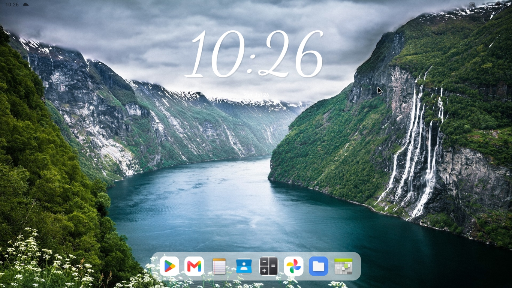

Please use the minimum width stated in in the software configurations. Please read the side loading note at the bottom

The following image⬆️uses increased clock size and cursive clock font in the settings menu.

# What is Optima?
Optima is an open source android launcher specifically designed for Android x86 and to be used with PC or laptop peripherals. Optima aims to make a sleek minimal desktop for any android computer or laptop

# Optima recommended hardware/software configurations
Optima in its current state was tested on the following:

1. Optima was tested and designed around 16:9 displays (now it works on all displays)

2. Optima was tested and works best on a minimum width of ≈ 715

3. Optima was tested on Android-x86 9.0 R2 but can be used on many other Android x86 distros

4. Optima requires Android 9.0+

5. Me as koji76w, Highly recommends using regular Android x86, while distros like PrimeOS do work their SystemUI custom taskbars often interfere with the dock on the desktop + Android x86 has root and super user allowing you to only have the navigation bar pop up when its needed and not stay covering the dock
(see how to do this is the extra info)

# Optima navigation and use
1. Move your mouse cursor to the far left to open the app drawer and click the settings icon to get to the launcher settings and customization.

2. Move your mouse cursor to the far right to open the notifacation drwer which includes stats like the battery

3. Hold click on apps in the dock to remove or uninstall

4. Hold click on apps in the app drawer to add them to the dock, uninstall them, or hide them

5. Hold click the clock to change its y position, size, thickness, and font

# Planned features
1. Widgets about the status of the device

2. Apps on the desktop

# How to change the minimum width on your device?
1. Go to the settings app and Click "About"

2. Click the buildnumber 7 times to enable developer mode

3. Find and click on developer options

4. Find the minimum width text box and change it to 715

# Extra info
1. For a better experience, use an androidx86 distro that doesnt have a task bar baked into the navigation bar like the original Androidx86 project

2. For a better experience, open the virtual terminal in the original android-x86 project (or connect to adb on a computer, type in command prompt `adb shell`), and run:
   ```bash
   adb shell settings put global policy_control immersive.full=*
this will stop the navigation bar from mindlessly covering the desktop dock

3. Optima can work on android emulators with some flaws like the added difficulty of opening the app drawer or notifications drawer + dock tooltip not working

4. Note While general Android emulators are supported with minor quirks, Optima is primarily engineered and optimized for Android-x86 desktop/laptop environments

5. If you run into any bugs, feel free to open an issue on the GitHub repository!

# Sideloading note
When installing Optima, Google Play Protect might show an "App blocked" warning because it's a direct GitHub release. Just go to play protect settings, pause play protect, and install Optima again—it's completely safe and open-source!
