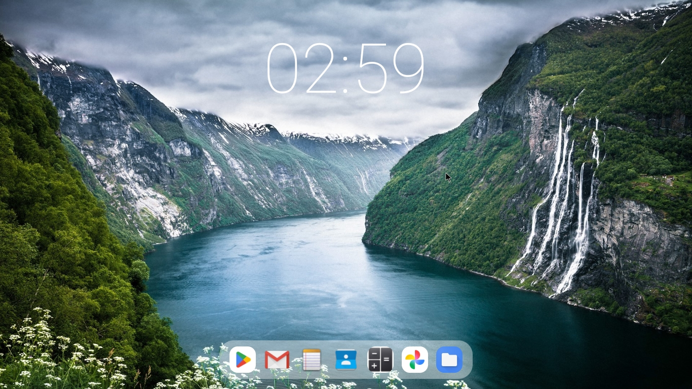

Please use the minimum width stated in in the software configurations
# What is Optima?
Optima is an open source android launcher in beta specifically designed for Android x86 and to be used with PC or laptop peripherals. Optima aims to make a sleek minimal desktop for any android computer or laptop

# Optima recommended hardware/software configurations
Optima in its current state was tested on the following:
1. Optima was tested and designed around 16:9 displays
2. Optima was tested and works best on a minimum width of ≈ 813 - 829
3. Optima was tested on Android-x86 9.0 R2 but can be used on many other Android x86 distros
4. Optima requires Android 9.0+

# Optima navigation and use
1. Move your mouse cursor to the far left to open the app drawer
2. Move your mouse cursor to the far right to open the notifacation drwer which includes stats like the battery
3. Hold click on apps in the dock to remove or uninstall them
4. Hold click on apps in the app drawer to add them to the dock or uninstall them
5. Hold click the clock to change its y position, size, and thickness

# How to change the minimum width?
1. Go to the settings app and Click "About"
2. Click the buildnumber 7 times to enable developer mode
3. Find and click on developer options
4. Find the minimum width text box and change it to 813 - 829
